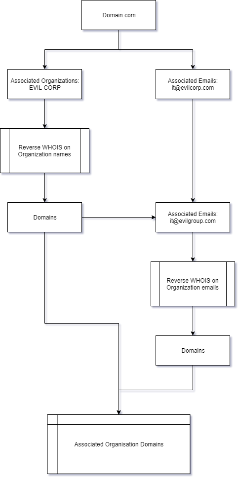
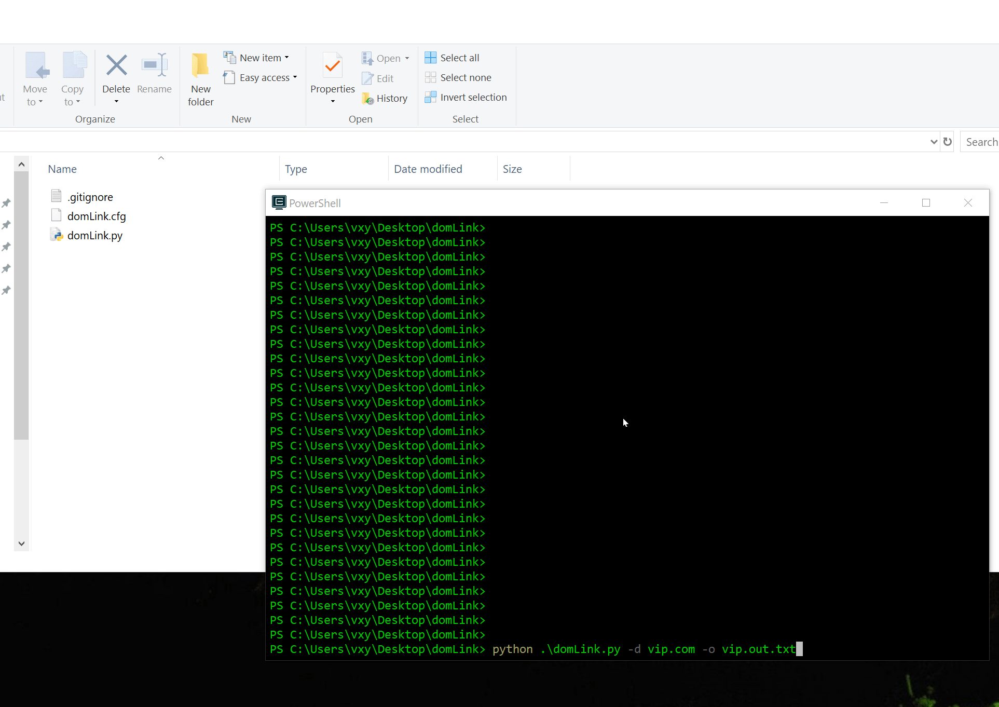

# DomLink

## Blog Post

https://vincentyiu.co.uk/red-team/reconaissance/domlink-automating-domain-discovery

## Author

Vincent Yiu (@vysecurity)

### Contributors

John Bond (@b4ldr)
Jan Rude (@whoot)

## What is DomLink?

DomLink is a tool that uses a domain name to discover organisation name and associated e-mail address to then find further associated domains.

This is useful for bug bounty and red team engagements where you need to discover more domains associated with the target.

## How does it work?



## Usage

1) Get an API key from WHOXY.com
2) Set that API key in a file named ```domLink.cfg``` in the same directory.

```
python domlink.py -D target.com -o target.out.txt
```

## Example


